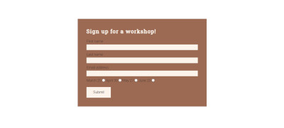

# ZERO WASTE DESIGN

The Zero waste design website is a responsive website with information about creativity with fabric scraps and workshops. 

[View Zero waste design on Github pages](https://maryannelee.github.io/zero-waste-design/index.html)

---

## CONTENTS

* [User Experience](#user-experience-ux)
  * [User Stories](#user-stories)

* [Design](#design)
  * [Colour Scheme](#colour-scheme)
  * [Typography](#typography)
  * [Imagery](#imagery)
  * [Wireframes](#wireframes)

* [Features](#features)
  * [General Features on Each Page](#general-features-on-each-page)
  * [Future Implementations](#future-implementations)
  * [Accessibility](#accessibility)

* [Technologies Used](#technologies-used)
  * [Languages Used](#languages-used)
  * [Frameworks, Libraries & Programs Used](#frameworks-libraries--programs-used)

* [Deployment & Local Development](#deployment--local-development)
  * [Deployment](#deployment)
  * [Local Development](#local-development)
    * [How to Fork](#how-to-fork)
    * [How to Clone](#how-to-clone)

* [Testing](#testing)

* [Credits](#credits)
  * [Code Used](#code-used)
  * [Content](#content)
  * [Media](#media)
  * [Acknowledgments](#acknowledgments)

---

## User experience (UX)

Zero waste design wants to inspire people to use fabric scraps in their creativity.  Most fabric scraps are often thrown away but could be used to create useful and beautiful items instead. Workshops are arranged once a month with a lot of fabric scraps to choose from and a chance to get inspired by each other.  

### User stories

#### User goals
Make visitors find out what zero waste design is and get inspired. 
Make visitors know more about natural fabrics.
Make visitors find out how and when to take part in workshops.

#### First time visitor goals
Know more about zero waste design.
Get inspired by the portfolio photos. 
Sign up for workshops.
Find the social media links.

#### Returning visitor goals
Find up to date workshops to sign up for.

## Design

This is my first project and it was made with a lack of time. The design has been influenced by the “Love running”-project at Code Institute. I wanted to create a clean looking website with colors that didn't stand out and blend in well with the inspirational images. My aim was also a solid foundation to work with in upcoming changes and improvements. Mostly improvements in the design because it's a bit simple now.

### Colour Scheme

The color palette was created using [Colorminds](http://colormind.io/)

### Typography

[Google Fonts](https://fonts.google.com/) was used. 

I used a combination of Roboto (300) and Roboto slab for the headings. I like the mix of serif and sans-serif. 

### Imagery

Most of the images are my own (things that I've made with fabric scraps) except the image on the workshop page which is from [Pexels](https://www.pexels.com/)

### Wireframes

I didn´t use any Wireframes because there wasn´t enough time to learn another new thing at this point. Instead I went old school and used pen and papper. 

## Features

Zero waste design is a website with four pages. 
Three of the pages are accessible from the navigation menu.
- Home page, with information about zero waste design and the material that is used.
- Portfolio, with images of items that was created with fabric scraps.
- Workshops, with dates and sign up form. 
The fourth page is a thank you page thats is shown when a user submits the form on the workshop page.

### Header and navigation 

The header consists of a logo and the navigation menu. Easy for the user to see what pages are on the website and to alter between them.
The hero header contains an image of products made of fabric scraps and some text what this website is about.

### Fabric information

Information about the fabrics that is used in the designs and in the workshops. Good information for the user to know. 

### Portfolio 

Images showing designs made of fabric scraps. Inspirational for the user to see what you can create with fabric scraps.

### Workshops

The first section of the workshop page shows the dates and place for the workshops that the users can choose from. It also consists an image at the top. 

The second section of the workshop page contains a sign up form for the workshops. The user can fill in which date they want to attend the workshop and have to fill in name and email address.

### Thank you page

The thank you page shows a message to user that submit the sign up form. The user get information that message has been recieved and that they will get more information about the workshops. 

### Footer

The footer contains four social media icons and links. It's for the user to be able to interact with Zero waste design on social media. 

### General features on each page

All pages have
- A responsive navigation bar and the logo at the top. 
- A footer which contains social media icon links.

### Future Implementations

- A page about the person running the Zero waste design website and contact info.
- A fully functional sign up form. 

### Accessibility

For the accessibility this was used:
- Semantic HTML.
- Alt attributes on images
- Sufficient colour contrast.
- Marking the current page as active.

## Technologies Used

### Languages Used

- HTML
- CSS 

### Frameworks, Libraries & Programs Used

- Github
- Gitpod
- Google Fonts 
- Google Dev Tools 
- Gimp 
- Am I Responsive? 
- Font awesome

## Deployment & Local Development

### Deployment

Github Pages was used to deploy the live website. The instructions to achieve this are below:

- Log in (or sign up) to Github.
- Find the repository for this project, zereo-waste-design.
- Click on the Settings link.
- Click on the Pages link in the left hand side navigation bar.
- In the Source section, choose main from the drop down select branch menu. Select Root from the drop down select folder menu.
- Click Save. Your live Github Pages site is now deployed at the URL shown.

### Local Development

#### How to Fork

To fork the Zero waste design repository:

- Log in (or sign up) to Github.
- Go to the repository for this project, MaryAnneLee/zero-waste-design
- Click the Fork button in the top right corner..

#### How to Clone

To clone the Zero waste design repository:

- Log in (or sign up) to GitHub.
- Go to the repository for this project, MaryAnneLee/zero-waste-design
- Click on the code button, select whether you would like to clone with HTTPS, SSH or GitHub CLI and copy the link shown.
- Open the terminal in your code editor and change the current working directory to the location you want to use for the cloned directory.
- Type 'git clone' into the terminal and then paste the link you copied in step 3. Press enter.

## Testing

- Chrome developer tools was used to find any issues while building the website. 

- The W3C validators for HTML and CSS was used when the website was finsihed. No errors on CSS and a few errors on HTML-pages but this was solved. See details below on Solved bugs. 

- Lighthouse testing

### Solved bugs

1. Menu navigation elements in the wrong order. 
 Solution: Serched W3 schools for an solution for this and found that I should use [flex-end](https://www.w3schools.com/css/tryit.asp?filename=trycss3_flexbox_justify-content_flex-end
)

2. Responsive issues images. The hero header and one of the images in the about materials sections was cropped on smaller screens. 
Solution: The third image on the page had a width that was bigger then tha screen and affected the other images. To change that width from px to % on smaller screen changed that. Got help from Code institute tutor team on this one. 

3. Responsive issues navigation bar. On smaller screens the nav bar "got hidden" by the hero image. 
Solution: Removed float:left on the logo. Got help from Code institute tutor team on this one. 

4. W3C Validator pointed out one thing on index.html - "section lacks heading. Consider using h2-h6 elements to add identifying headings to all sections, or else use a div element instead for any cases where no heading is needed."
Solution: Didn¨t like the layout I first created so changed it and also added a heading. 

5. W3C validator pointed out one thing on portfolio.html - "Section lacks heading. Consider using h2-h6 elements to add identifying headings to all sections, or else use a div element instead for any cases where no heading is needed."
Solution: Changed section to div because didn't want a heading.

6. W3C validator pointed out four things on workshops.html - 
- "Section lacks heading. Consider using h2-h6 elements to add identifying headings to all sections, or else use a div element instead for any cases where no heading is needed."
Solution: Changed section to div because didn't want a heading.

- "Bad value for attribute action on element form: Must be non-empty."
Solution: Was empty because I hadn't yet created the thank you-page for the form, but was added after writing this. 

- "Saw an end tag after body had been closed."
Solution: Removed the extra </body>

- "Consider using the h1 element as a top-level heading only (all h1 elements are treated as top-level headings by many screen readers and other tools)."
Solution: Changed heading to h2 which was what I wanted there. 

7. After adding a thankyou-page to the form it didn't show when submitting the form. 
Solution: After looking at my code and my notes on forms from Code institute I changed method:post to method:get and the thankyou page now works when filling out the form. 

8. Got feedback on slach from John Dickson on my peer-code-review
- There is white space below the footer once the transition to media screen max width 760px happens.
Solution: I changed the width on the section above and also changed the media queries a bit. 
- The sign up form is slightly off centre for the different media screen sizes.
Solution: I used flex and justify:center on the section.
- Would you consider uploading your hand drawn wireframes to the README?
Solution: Uploaded my hand drawn wireframes altough they are difficult to read for anyone else. 

Apart from these issues there have been a few minor issues, but mostly just testing my way through because using HTML and CSS are all new to me. So there's been a few changes, mostly on the homepage and trying to figure out the best way and style to display the images and text. 

## Credits

### Code Used

- Some inspiration and code came from Code institutes "Love Running"-project. 

- The wonderful readme template came from [Kera Cudmore](https://github.com/kera-cudmore/readme-examples/blob/main/milestone1-readme.md)

### Content

Written by Anne-Lie Smith.

###  Media

Images are mostly my own but the one in the workshop page is from pexels.com.
  
###  Acknowledgments

A special thanks to peolpe that helped me complete my first portfolio project!
- Martina Terlevic, my Code institute mentor.
- Paul Thomas O'Riordan for helping out with questions in our Slack class channel.
- Kera Cudmore, for all the information about the Readme-file.
- Oisin, at the Code institute tutor team for helping me out with responsive issues. 
- John Dickson, for viewing my website and gave me feedback on my peer-code-review on Slack